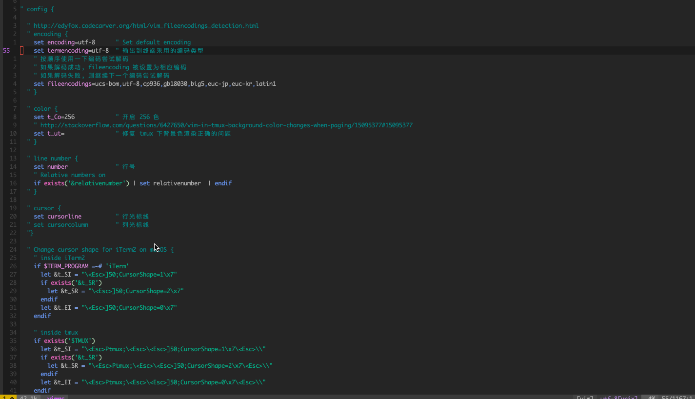

# mini-vim

极简 vim 配置, 方便快速的配置一个简单好用的 vim  

## 使用

使用 curl 安装:  

	$ curl https://raw.githubusercontent.com/MwumLi/mini-vim/master/vimrc ~/.vimrc

使用 wget 安装:  

	$ wget https://raw.githubusercontent.com/MwumLi/mini-vim/master/vimrc -O ~/.vimrc

使用 git 克隆:  

	$ git clone https://github.com/MwumLi/mini-vim && cp mini-vim/vimrc ~/.vimrc && rm -rf mini-vim
